# Git - Version Control System
Git is a distributed Version Control System (VCS).

## Why Git:
* Many open source geospatial projects are developed using Git.
* Common tool to develop software.
* Better project management.
   * No more project1.py, project2.py, project_final, project_final2 etc.
   * Versioning and tracking changes are systematic, hence, easier.
* GitHub
   * Web based hosting service
   * Free and Open Source for Geospatial (FOSS4G) are hosted on GitHub. Some renowned examples include [QGIS](https://github.com/qgis), [PostGIS](https://github.com/postgis/postgis) and [GeoSever](https://github.com/geoserver/geoserver). Please note how active these projects are.
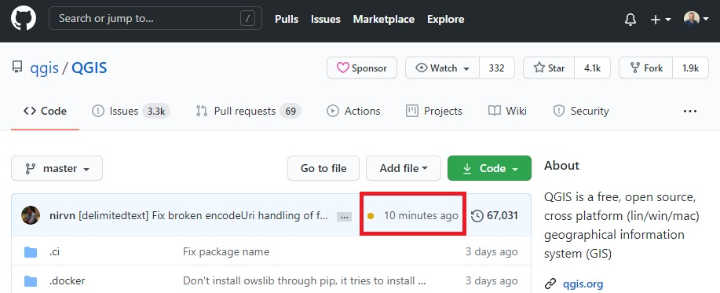
* Many online tutorials ease learning.

## Installation
* Download Git from [https://git-scm.com/](https://git-scm.com/)
* Leave the default options until ***Choosing the default editor***
   * Vim is the default, but it could be complicated for beginners.
   * Choose the editor that you feel comfortable with.
   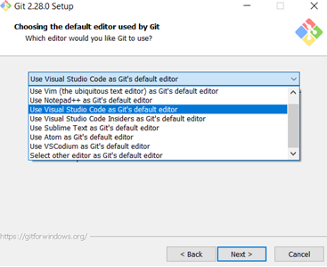
* Leave the rest options in their default values:
   * Adjusting your Path environment,
   * Choosing HTTPS transport etc.

## Hello Git
* Git Bash
   * A Command Line Interface (CLI) to use Git.
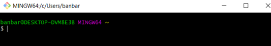
   * Better for learning, but it might be difficult to get used to.
   * Open Git Bash by right-clicking the project's folder.
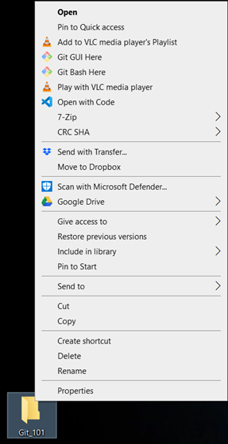
* Investigate Git GUI - installed with Git.
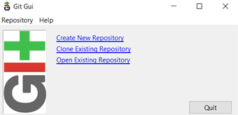
* Investigate [GitHub Desktop](https://desktop.github.com/) - separate software.

## Git Commands
* This section will define and describe some of the common Git commands.

### init
* **git init** initialises a folder.
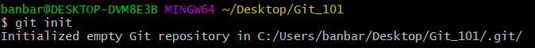
* Creates the hidden **.git** folder. In order to see it, go to ***Folder Options*** and select ***Show hidden files, folders and drivers***.

### config
* Provides the configuration of the project.
   * Name of the contributor, email etc.
   * New attributes could be added.
   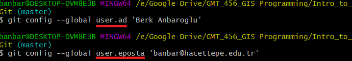
   * To view the configuration details: `git config --list`
   * To edit our own parameters: `git config --global --edit`
   * To remove e.g. user.name: `git config --global --unset-all user.name`

### add
* Adds the file(s) to index.
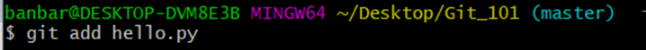
* With `git add hello.py` we index our first file - hello.py.
* `git add .` will add all the files and folders to the index.

### status
* Checks the current state of the working directory. Which files are tracked, which of them were updated etc.

* We can observe the:
   * **branch** we are working on -i.e. master.
   * **Updated** files.
      * Here we observe that we need a **commit** to make changes recorded for future use.

### commit
* Captures the snapshot of the project's staged changes.
* Safe version of the project, which can be used to refer to later on.
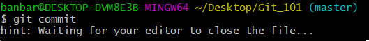
* This would open *VSCode* as it was chosen as the default Git Editor. Here, we will prompt a commit message.
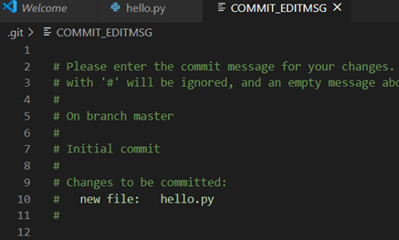
* A shorter way of doing this is to provide the commit message within the Git CLI: `git commit -m "An explanatory message of this commit`.

### log
* Displays the past commits and their messages.
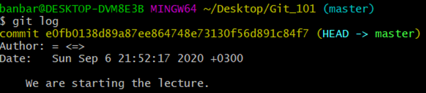
* Commit identifiers (long arbitrary text) would be useful to visit a previous commit.
* Once the project has many commits, it might be useful to track the milestones. Therefore, [**commit messages are important**](https://www.freecodecamp.org/news/writing-good-commit-messages-a-practical-guide/).
* `git log --oneline` provides a simplified view of the previous commits - each in one line.

### rm
* We might need to remove a file that was previously added from the index.
* `git rm -cached <file>`

### clone
* Copied a remote repo to your local machine.
* Clone the content of our course to your computer: `git clone https://github.com/banbar/GMT-456-GIS-Programming`

## Useful Workflows

## Branches
* If we working on a new feature, it might be better to open a new branch in  order to make sure that the master branch is intact.
* Provides an isolated environment to test a new feature.
* Two or more developers can work on different branches at the same time.
* To view the branches of a repo: `git branch -a`. This would result something like:

   * The * indicates the current branch we are on.
   * The red lines indicate the remote branches (i.e. the branches on GitHub).
* Create a new branch entitled **feature-1**: `git branch feature-1`.
   * This command does not immediately change our working branch.
   * Note that once we view all the branches with `git branch -a`, we realise the presence of our new branch **(feature-1)**, and that the branch we are on did not change - we are still on the master branch.
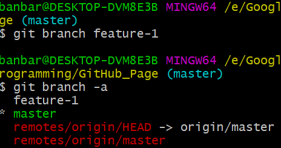
* To change our branch to **feature-1**: `git checkout feature-1`.
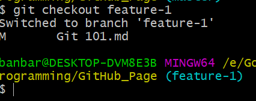
* Now, let's **add a new file** to our branch: **Git_102.md**. You may see the added file with `git status`
   * Next steps:
    * `git add Git 102.md` - add the new file to the stating area.
    * `git commit -m 'New markdown file - Git 102.md'`

## Ignoring files
* Some files are sensitive (e.g. database passwords, private keys etc.) or they are simply not directly related to our project.
* Do **not** track those files.
   * We need the .gitignore folder.
   * xxx: touch gitignore

### Undo the Last Commit
xxx

### Handling Merge Conflicts
xxx

### Sync with a GitHub Repo
xxx

## Discussion
* This section is open to discuss some specific examples, which would hopefully be useful to our overall understanding of how Git works.

### What is the benefit of git's two-stage commit process (staging)?
* In Git there is a two-stage commit process. We first add the files to the staging area (index), and then we commit these changes.
* The benefits of this process are described in several resources [1](https://gitolite.com/uses-of-index.html), [2](https://softwareengineering.stackexchange.com/questions/69178/what-is-the-benefit-of-gits-two-stage-commit-process-staging) and summarised here:
   * One large change of multiple files -> multiple commits instead of a single one. Use the `git gui` for a better management of this.

### Fork vs. Clone
*  Fork is done on GitHub Account while clone is done on Git.
* Changes made to the forked repo can be merged with the original repo via a pull request.

## Useful Practices

This section briefly describes the useful patterns while using git.

* `git diff` before committing.
