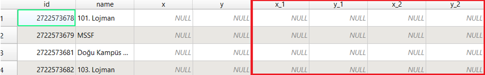

# Midterm Project Guidelines 
# Due: 3 December

Fork the course’s [**GitHub page**](https://github.com/banbar/GMT-456-GIS-Programming). You may start investigating the QGIS plugin under the `save_attributes/` folder.

The GUI of the plugin is as follows:

At the moment, this plugin adds two attributes (X and Y) to a point shp file and populates them by inserting the relevant values corresponding to each feature. 

The objective of the midterm project is to update the plugin such that the following requirements are satisfied:

* If a ***point*** shp file file is provided, it will identify the distances between all features (points). 
* The plugin will then ***create a new line shp file***, which provides the details of the **two special lines** (i.e. the min/max distance between the two closest/distant points, where the distance is calculated as the shortest distance between two points).  
   * Template of the resulting line shp file looks like:
      
| ***optional***            | ***optional***                  |                                                |
|---------------------|-------------------|------------------------------------------------|
| **poi\_id\_start**      | **poi\_id\_end**       | **length**                                         |
|     shortest\_start |     shortest\_end |     distance between two closest pairs         |
|     longest\_start  |     longest\_end  |     distance between two most distant pairs    |

   * If the user provided an id field corresponding to each point feature, then the start and end points of these two special lines are recorded as shown in the first two columns. 
   * If there is no such id field, the user will check the box ‘No ID’, and then only the length of the lines are recorded. That’s why the first two fields (id_start and id_end) are optional.
   
* If a ***polyline*** shapefile is provided, it will add two attributes (fields) to the shp file.
   * The first attribute is ***length***, which records the ***actual length*** of the polyline.
   * The second attribute is ***shortest_length***, which first identifies the start and end points of a polyline, and records the shortest distance between these two points.
* If a ***polygon*** shapefile is provided, provide a gentle warning to the user stating that the plugin cannot operate on polygons.

You need to consider the following adjustments to increase the quality of your plugin: 

1. Add a control statement that checks whether a new field that you define is already present or not. If the new field(s) are present, there is no need to add once more. This will be useful when debugging the code multiple times, and prevent situations like this in which we add the same attributes (i.e. x and y) multiple times:

2. At the moment, the plugin adds the X and Y fields regardless of the input geometry. Make sure that the new fields are added only when **point** geometries are input. 
3. Investigate ways in which to increase the quality of the GUI layout. At the moment, the ***horizontal layout*** is not correctly structured, so that the “browse” button takes more space than it should. Can you also identify other aspects which increases the quality of the GUI?

4. Each student in a group should add one new feature. For this, **each student must create a new branch**, add the new feature to this branch and then **merge it back**. Understand how different **merge** options will take place. Follow these [1](https://youtu.be/QV0kVNvkMxc), [2](https://youtu.be/XX-Kct0PfFc) references for a better understanding of branch-merge process.

