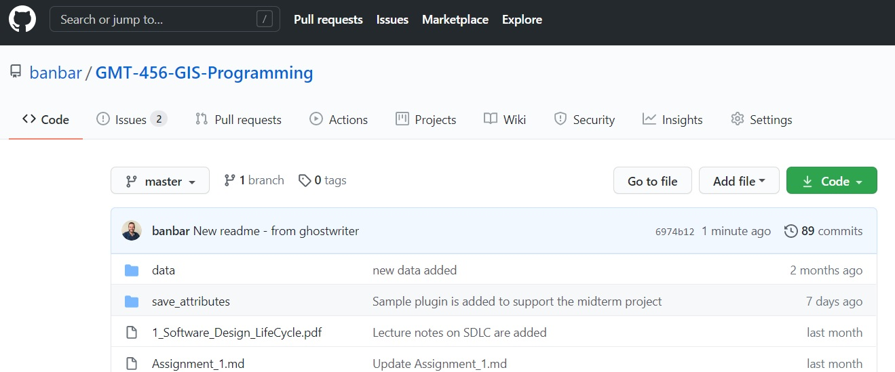

# GMT 456 GIS Programming
This repository contains sample data, information and code about the "GMT 456 GIS Programming" course offered at the Geomatics Engineering Dept. of Hacettepe University, Turkey.

The **aim** of this course is to teach students how to collaborate on a software project involving spatial analysis by using git.   

The **successful students** would: 
* ***Describe*** the Software Design Life Cycle (SDLC) phases,
* ***Document*** the design and requirements of the software project that s/he worked on, 
* ***Demonstrate*** the ability to work as a team for the purpose of developing a new or updating an existing QGIS plugin.

## Contents:
* Object oriented programming - recap
   * Function Calls – pass by reference vs pass by value
* Data structures (arrays, linked lists, graphs) - recap 
* Qt Designer
   * Signal- Slot
* Google Earth Engine
* Building a QGIS Plugin

## Assignment 1 (deadline: 16 Oct):
You will be submitting your README.md files on the comparison of different SDLC methodologies to this address: 
https://classroom.github.com/a/Wnp3Y_Qw

## Software:
* QGIS 3.x 
* [Anaconda Individual Edition](https://www.anaconda.com/products/individual)
   * Spyder Integrated Development Environment (IDE) for Python scripting

## Resources:
* Software Engineering
   * [PEP 8 Style Guide](https://www.python.org/dev/peps/pep-0008/)
   * [A Comparison between Agile and Traditional Software Development Methodologies](https://www.unf.edu/~broggio/cen6940/ComparisonAgileTraditional.pdf)
* Google Earth Engine
   * [Google Earth Engine - Beginner's Cookbook](https://developers.google.com/earth-engine/tutorials/community/beginners-cookbook)
* Git
   * [Git Cheat Sheet - from GitHub](https://education.github.com/git-cheat-sheet-education.pdf)
   * [Saving Changes - add vs commit](https://www.atlassian.com/git/tutorials/saving-changes)
   * [Learning Git 101 by Yasoob Khalid](https://yasoob.github.io/learn-git/)
* Git GUI
   * [GitKraken](https://www.gitkraken.com/)
   * [Pretty git branch graphs](https://stackoverflow.com/questions/1057564/pretty-git-branch-graphs)
      * [JSFiddle](http://jsfiddle.net/fracz/q76vj8ow/)
      * [Git Grapher](http://bsara.github.io/git-grapher/)
      * [Commits Graph](https://github.com/tclh123/commits-graph)
      * [Gitinspector - statistical analysis on a repo](https://github.com/ejwa/gitinspector)
    

* GitHub
   * [GitHub Campus Advisor Training](https://www.youtube.com/playlist?list=PLIRjfNq867be7VngMuXsjTvzBM26nBINg)
   * [Understanding the GitHub flow](https://guides.github.com/introduction/flow/)
   * [Using Markdown](https://commonmark.org/help/)
      * [GitHub Flavored Markdown](https://enterprise.github.com/downloads/en/markdown-cheatsheet.pdf)
   * [Workflow](https://enterprise.github.com/downloads/en/github-flow-cheatsheet.pdf)
   * GitHub is cool. 
* QGIS
   * [Plugin Builder](https://g-sherman.github.io/Qgis-Plugin-Builder/)
   
 
* [spatialthoughts](https://github.com/spatialthoughts/courses)
   * [PyQGIS in a Day](https://courses.spatialthoughts.com/pyqgis-in-a-day.html)
   * [Part 1: Building a Python Plugin (QGIS3)](https://www.qgistutorials.com/en/docs/3/building_a_python_plugin.html)
   * [Part 2: Building a Processing Plugin (QGIS3)](https://www.qgistutorials.com/en/docs/3/processing_python_plugin.html)
 
* **Book**: [Geoprocessing with Python](https://www.manning.com/books/geoprocessing-with-python)
* **Book**: [Applied Spatial Data Analysis with R](https://www.springer.com/gp/book/9781461476177)
* **Book**: [Introduction to GIS Programming and Fundamentals with Python and ArcGIS](https://www.routledge.com/Introduction-to-GIS-Programming-and-Fundamentals-with-Python-and-ArcGIS/Yang/p/book/9780367573775)
* **Book**: [The PyQGIS Programmer's Guide: Extending QGIS 3 with Python](https://locatepress.com/ppg3)
